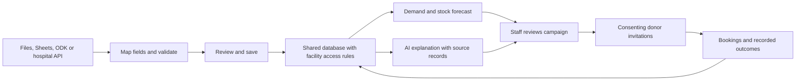

# Services and connectors for different blood banks

Recommendation, checked against official documentation on 21 September 2026. This is an integration roadmap, not a claim that these services are already connected.

## Start with two external services

**Supabase** now stores validated daily history, reports, measured values and import provenance in the shared project. [Applied schema and setup](../supabase/README.md). The Streamlit server holds the secret key; public clients have no table access. Demo identities and bookings still use the original local store. Supabase Auth, organisation membership policies and private Storage for original files remain future work. A cloud database alone does not establish production hospital isolation. [Database documentation](https://supabase.com/docs/guides/database/overview), [storage access policies](https://supabase.com/docs/guides/storage/security/access-control).

**OpenAI API** provides answers grounded in permitted records, understandable summaries and, later, suggested mappings from unfamiliar column names into the application schema. Structured output constrains the response format; it does not establish medical or numerical correctness. Keep deterministic validation and the forecasting model in Python. The feature branch adds a Responses API connection, with the API key kept on the server and no canned-answer fallback. A live call still requires a configured key. [Structured outputs](https://developers.openai.com/api/docs/guides/structured-outputs).

These are separate responsibilities: the database stores facts, a tested numerical model predicts demand, and the language model explains the supplied evidence. Forecasting should keep working when the language-model provider is unavailable.

## Add connectors according to a bank's actual workflow

| Situation | Recommended connector/service | What we implement |
| --- | --- | --- |
| Staff upload exports | Native CSV/Excel import | Column mapping, date/unit validation, preview, import provenance and repeat-import protection. The current feature branch supports defined CSV/JSON schemas; arbitrary Excel layouts need a mapping wizard. |
| Staff maintain Google Sheets | n8n or a direct Sheets connector | A scheduled or change-triggered import into the same validation pipeline. n8n has a Google Sheets trigger; it does not supply blood-domain mappings for us. [Documentation](https://docs.n8n.io/integrations/builtin/trigger-nodes/n8n-nodes-base.googlesheetstrigger/) |
| Staff work with unreliable connectivity | ODK Collect + Central | A simple stock-audit form collected offline and synced later; import Central submissions through its API. Imported timestamps remain visible so stale stock is never presented as live. [Getting started](https://docs.getodk.org/getting-started/), [Central API](https://docs.getodk.org/central-api/) |
| Donor outreach is ready | One SMS provider selected for the target country | An outbox, staff approval, consent/opt-out checks, duplicate-send protection, delivery events, replies and booking links. Twilio exposes messaging and status callbacks. Africa's Talking is an alternative in supported markets; its products vary by country. [Twilio](https://www.twilio.com/docs/messaging/api), [delivery callbacks](https://www.twilio.com/docs/messaging/guides/track-outbound-message-status), [Africa's Talking coverage](https://help.africastalking.com/en/articles/2727792-which-countries-are-africa-s-talking-products-in) |
| A hospital exposes a clinical interface | A connector for its supported FHIR, HL7 v2 or vendor API | Confirm version, profiles, permissions and meaning of local codes with that institution. FHIR does not guarantee every blood-bank inventory workflow is available. [FHIR overview](https://fhir.hl7.org/fhir/overview.html), [v2 comparison](https://fhir.hl7.org/fhir/comparison-v2.html) |
| An organisation already uses DHIS2 | Its authenticated Web API | Map only the relevant datasets and organisation units. DHIS2 recommends API integration rather than reading its database directly. Do not assume its aggregate reporting data is a live unit-level stock ledger. [Integration guide](https://developers.dhis2.org/docs/integration/overview/) |

For scanned documents, add an OCR/extraction stage only when there is a concrete input example. Require review of extracted quantities, blood groups, product types and dates before storing them as operational records. A legible PDF is not automatically reliable structured stock data.

## The common data format is the key product work

No service makes arbitrary data from every bank interchangeable. Build reusable per-bank mappings into a versioned common schema:

- Organisation and facility identifiers; source system and source record ID.
- Product/component type (for example red cells or plasma), ABO/RhD and quantity with unit. Do not sum unlike products or confuse bags, units and millilitres.
- Stock status: usable, reserved, quarantined or expired; collection/expiry timestamps where available.
- Observed-at and imported-at timestamps, timezone, original file/batch, mapping version and corrections.
- Demand requested separately from demand fulfilled, donations collected separately from appointments, and processing yield/delay assumptions.
- Donor contact preferences and service-defined eligibility dates, separated from laboratory details.

Support established blood-product identifiers such as ISBT 128 where the source uses them; preserve original codes and maintain reviewed mappings. ISBT 128 is an identification/coding standard, not a public database of all blood-bank stock. [ICCBBA standard](https://iccbba.org/our-standard/).

The AI can suggest that `O neg`, `O NEGATIVE` and `O-` share a mapping. A person confirms ambiguous meanings; code rejects invalid values. Save the approved mapping for later imports. Missing records remain unknown, and a missing day is not silently treated as zero demand.

## Target workflow

## Build order and proof

1. Finish local save/upload → forecast → grounded AI, using synthetic records. Prove that changing the stored inputs changes the output and that users cannot retrieve other users' records.
2. Add reusable CSV/Excel mappings and three different synthetic bank schemas. Prove that imports produce equivalent records and that malformed/ambiguous fields stop for review.
3. Extend the implemented Supabase data layer with production identity and test cross-organisation isolation, private uploads and migrations. Keep provider credentials server-side.
4. Add one source connector: Sheets for an online spreadsheet workflow, or ODK for offline stock collection. Prove replay, corrections, stale reports and failed synchronisation do not corrupt counts.
5. Add one messaging provider after destination-country selection. Use test numbers/sandboxing first; verify consent, opt-outs, retries and booking outcomes before real outreach.
6. Implement a hospital/vendor or DHIS2 connector only against its documented interface and representative records. Until then, advertise supported imports and adaptable connectors rather than universal integration.

No weather feed, mapping service, vector database or clinical-trial API is required for the core blood-supply workflow. Add these only when a validated use case needs them.
